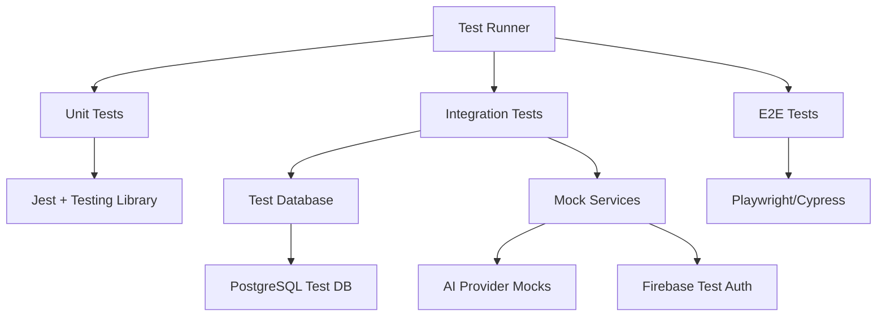

# Design Document

## Overview

This document outlines the design for a comprehensive testing suite for the AI Pitch Deck Generator application. The testing strategy follows industry best practices with a focus on reliability, maintainability, and comprehensive coverage across all application layers.

## Architecture

### Testing Pyramid Structure

```
    /\
   /  \    E2E Tests (10%)
  /____\   - Critical user journeys
 /      \  - Cross-browser testing
/________\ Integration Tests (30%)
          - API integration
          - Database operations
          - Component integration
__________
Unit Tests (60%)
- Service logic
- Component behavior  
- Utility functions
```

### Test Environment Architecture



## Components and Interfaces

### Backend Testing Components

#### 1. Unit Test Framework
- **Framework**: Jest with TypeScript support
- **Mocking**: Jest mocks for external dependencies
- **Coverage**: Istanbul for code coverage reporting
- **Location**: `backend-nestjs/src/**/*.spec.ts`

#### 2. Integration Test Framework
- **Database**: Test PostgreSQL instance with TypeORM
- **HTTP Testing**: Supertest for API endpoint testing
- **Authentication**: Firebase Admin SDK test configuration
- **Location**: `backend-nestjs/test/integration/**/*.test.ts`

#### 3. Test Database Management
- **Setup**: Automated test database creation and migration
- **Seeding**: Consistent test data fixtures
- **Cleanup**: Automatic cleanup after each test suite
- **Isolation**: Each test gets fresh database state

### Frontend Testing Components

#### 1. Component Testing
- **Framework**: Jest + React Testing Library
- **Rendering**: Virtual DOM testing with jsdom
- **User Interactions**: FireEvent and userEvent simulation
- **Location**: `frontend/src/**/*.test.tsx`

#### 2. Hook Testing
- **Framework**: React Hooks Testing Library
- **Async Testing**: Proper handling of async hook operations
- **State Management**: Testing custom hooks with complex state
- **Location**: `frontend/src/hooks/**/*.test.ts`

#### 3. API Integration Testing
- **Mocking**: MSW (Mock Service Worker) for API mocking
- **Network Testing**: Simulated network conditions
- **Error Handling**: Testing error scenarios and retry logic
- **Location**: `frontend/src/services/**/*.test.ts`

### End-to-End Testing Components

#### 1. E2E Test Framework
- **Framework**: Playwright for cross-browser testing
- **Test Environment**: Isolated test environment with test data
- **Page Objects**: Reusable page object models
- **Location**: `e2e/**/*.spec.ts`

#### 2. Visual Regression Testing
- **Screenshots**: Automated visual comparison
- **Cross-browser**: Testing across Chrome, Firefox, Safari
- **Responsive**: Testing different screen sizes
- **Location**: `e2e/visual/**/*.spec.ts`

## Data Models

### Test Fixtures Structure

```typescript
// Test User Fixture
interface TestUser {
  id: string;
  email: string;
  firebaseUid: string;
  createdAt: Date;
}

// Test Project Fixture
interface TestProject {
  id: string;
  userId: string;
  name: string;
  description: string;
  decks: TestDeck[];
}

// Test Deck Fixture
interface TestDeck {
  id: string;
  projectId: string;
  title: string;
  slides: TestSlide[];
  mode: 'free' | 'custom';
}

// Test Slide Fixture
interface TestSlide {
  id: string;
  deckId: string;
  title: string;
  content: string;
  slideType: string;
  slideOrder: number;
}
```

### Mock Data Providers

```typescript
// AI Provider Mock Responses
interface MockAIResponse {
  provider: 'openai' | 'groq' | 'ollama';
  success: boolean;
  content?: string;
  error?: string;
  model: string;
}

// Firebase Auth Mock
interface MockFirebaseUser {
  uid: string;
  email: string;
  getIdToken: () => Promise<string>;
}
```

## Error Handling

### Test Error Categories

1. **Assertion Errors**: Clear test failure messages
2. **Setup Errors**: Database connection and seeding issues
3. **Timeout Errors**: Long-running test detection
4. **Mock Errors**: External service simulation failures
5. **Environment Errors**: Missing test configuration

### Error Recovery Strategies

```typescript
// Retry Logic for Flaky Tests
const retryTest = async (testFn: () => Promise<void>, maxRetries = 3) => {
  for (let i = 0; i < maxRetries; i++) {
    try {
      await testFn();
      return;
    } catch (error) {
      if (i === maxRetries - 1) throw error;
      await new Promise(resolve => setTimeout(resolve, 1000));
    }
  }
};

// Database Cleanup on Failure
afterEach(async () => {
  await testDb.cleanup();
  await clearTestCache();
});
```

## Testing Strategy

### Unit Testing Strategy

#### Backend Services
- **Isolation**: Mock all external dependencies
- **Coverage**: Test all public methods and edge cases
- **Validation**: Test input validation and error handling
- **Business Logic**: Focus on core business rules

#### Frontend Components
- **Rendering**: Test component rendering with various props
- **Interactions**: Test user interactions and event handling
- **State Changes**: Test component state updates
- **Accessibility**: Test ARIA attributes and keyboard navigation

### Integration Testing Strategy

#### API Integration
- **Request/Response**: Test complete HTTP cycles
- **Authentication**: Test protected endpoints
- **Data Persistence**: Test database operations
- **Error Scenarios**: Test error responses and handling

#### Component Integration
- **Data Flow**: Test data passing between components
- **Context Usage**: Test React context providers and consumers
- **Route Integration**: Test navigation and route parameters
- **Form Workflows**: Test complete form submission flows

### E2E Testing Strategy

#### Critical User Journeys
1. **User Registration and Login**
2. **Project Creation and Management**
3. **Deck Generation with AI**
4. **Slide Editing and Reordering**
5. **Export to PDF/PowerPoint**
6. **Template Usage**

#### Cross-Browser Testing
- **Chrome**: Primary browser testing
- **Firefox**: Secondary browser validation
- **Safari**: WebKit engine testing
- **Mobile**: Responsive design validation

## Performance Testing

### Load Testing Strategy
- **Concurrent Users**: Test 50 simultaneous users
- **API Endpoints**: Measure response times under load
- **Database Performance**: Test query performance with large datasets
- **Memory Usage**: Monitor memory leaks and garbage collection

### Metrics and Thresholds
- **API Response Time**: < 2 seconds
- **Database Queries**: < 500ms
- **AI Generation**: < 30 seconds
- **Page Load Time**: < 3 seconds
- **Memory Usage**: < 512MB

## CI/CD Integration

### Test Pipeline
```yaml
# Test Pipeline Stages
1. Install Dependencies
2. Lint and Type Check
3. Unit Tests (Parallel)
4. Integration Tests (Sequential)
5. Build Application
6. E2E Tests (Parallel)
7. Performance Tests
8. Generate Reports
9. Deploy (if all tests pass)
```

### Test Reporting
- **Coverage Reports**: HTML and JSON formats
- **Test Results**: JUnit XML for CI integration
- **Performance Metrics**: JSON reports with trends
- **Visual Regression**: Screenshot comparisons
- **Failure Screenshots**: Automatic capture on E2E failures

## Security Testing

### Authentication Testing
- **Token Validation**: Test JWT token handling
- **Permission Checks**: Test role-based access control
- **Session Management**: Test login/logout flows
- **CSRF Protection**: Test cross-site request forgery prevention

### Input Validation Testing
- **SQL Injection**: Test database query safety
- **XSS Prevention**: Test script injection prevention
- **File Upload Security**: Test malicious file handling
- **Rate Limiting**: Test API rate limiting functionality